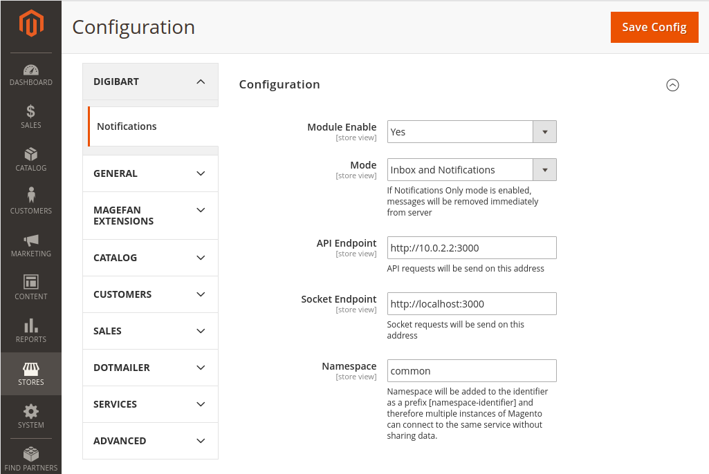
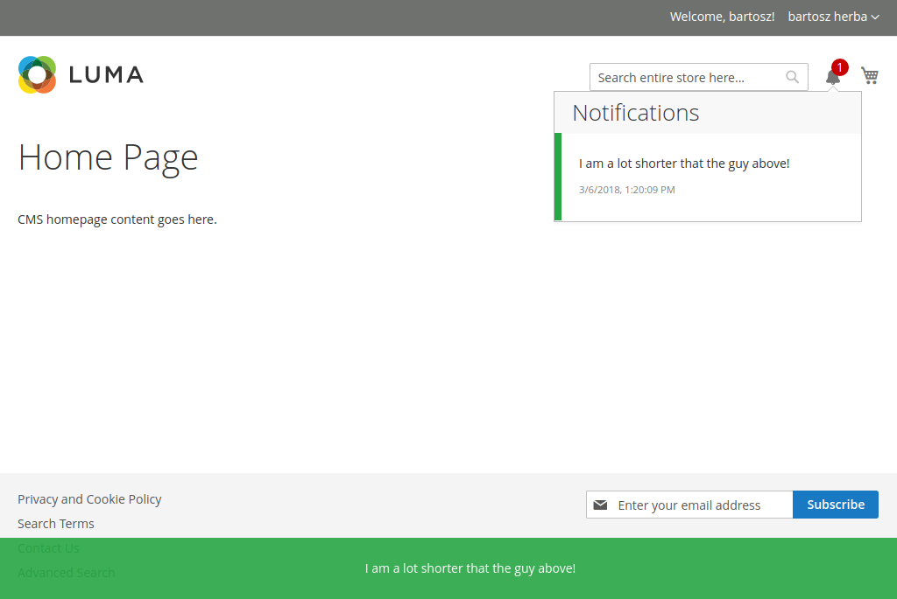

# Magento 2 Notification Service Client

This module is a client for [Notifications Microservice](https://bartoszherba.github.io/notifications-service/).
It allows customers to receive notifications in real-time and to store them in a private inbox.

# Configuration

Stores -> Configuration -> Digibart -> Notifications

* Module Enabled - enable/disable module's functionality
* Mode:
  * Inbox and Notifications - will display notifications and keep store them in private inbox
  * Inbox Only - only store notification in private inbox
  * Notifications Only - only show notifications (**NOTE: this will remove received notification from service**)
* Api Endpoint - service Api Endpoint
* Socket Endpoint - socket endpoint
* Namespace - in case of multiple clients it allows to create separated socket space

# Functionality

Shows notification for registered customers and eventually stores them in a private inbox

* Hover over message in your inbox to display additional actions
* Click on the notification to close it (or just wait a while patiently!)

